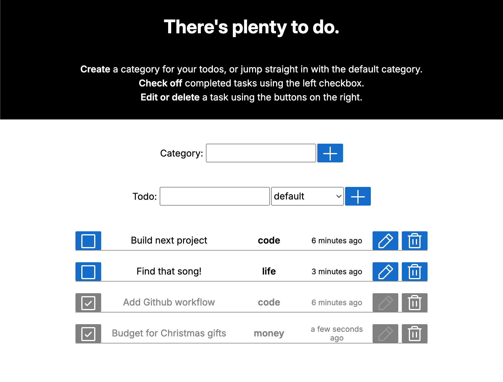

# Todo App UI

## Demo & Snippets

[Link to live]() (NOT YET DEPLOYED)

---

## Requirements / Purpose

This project is the frontend/UI for a Todo list app. The aim is to create a functional and responsive app where users can track, add, edit, and delete tasks and categories of tasks. Project backend can be found here: [todo-api](https://github.com/vadien/todo-app-backend)

##### Stack:

- ReactJS 18
- Sass (SCSS)
- HTML5
- [react-hook-form](https://react-hook-form.com/)
- [Zod](https://zod.dev/) (data validation)
- [DayJS](https://day.js.org/) (Time display)
- [Phosphoricons](https://phosphoricons.com/) (Icons)

---

## Build Steps

- Start by getting the backend running using the steps here: [todo-api](https://github.com/vadien/todo-app-backend)
- Clone this repo to a local folder and npm to install (`npm install`)
- Either use `npm run dev` for React Strict Mode or `npm run build` to build the project

---

## Design Goals / Approach

#### Goals:

- To implement a functional and complete frontend experience for a todo app with responsive styling.
- To successfully integrate the app with the backend database.
- To follow separation of concerns and DRY coding principles.

---

## Features

- Todo creation/editing/deletion/completion
- Task category creation
- Dynamic page updates on events
- Data validation
- Displaying errors from backend to user

---

## Known issues

Not yet deployed!

---

## Future Goals

(Data-related goals listed in the [backend readme](https://github.com/vadien/todo-app-backend))

- Full responsive design for mobile displays
- Component testing using React Testing Library
- Implement CI/CD using github workflow
- Deploy with Docker
- Styling pass
- Full refactoring pass
- Accessibility pass

---

## Change logs

##### 2024-09-04

- Refactor state handling
- Improve error styling and clarity

##### 2024-09-03

- Display completed todos separately
- Correctly update state on todo update
- Require delete confirmation if todo is incomplete
- Standardise styling across elements
- Disable edit on completed tasks
- Implement frontend sort on returned todos
- Update favicon/page title

##### 2024-09-02

- Update typing and schema data to match backend
- Update README
- Implement icons

##### 2024-09-01

- Create form/schema for category creation
- Create associated category services
- Fix bug in Todo form preventing category validation
- Styling first pass

##### 2024-08-31

- Implement frontend form and services
- Implement dynamic updates to UI
- Update Todo form for reuse in todo editing
- Implement relative time updates using DayJS library

---

## What did you struggle with?

- Implementing Zod validation for a select dropdown in a React form caused issues that took a while to nail down due to lack of feedback from the validator. Lesson: when code fails, investigate from the first point the error may be caused rather than working backwards from the point of failure.
- Deploying has been such a pain! At first I attempted to deploy the backend to an AWS EC2 instance and the frontend to Github Pages, but that creates issues with HTTPS/HTTP mixing which I don't have the knowledge to diagnose. Then I tried to deploy the frontend to the same EC2 instance, which ended up not working AND breaking the backend! Docker is definitely the next step, I just need a little more time to figure that out.

---

## Licensing Details

MIT License

Copyright (c) 2024 David Neill

Permission is hereby granted, free of charge, to any person obtaining a copy
of this software and associated documentation files (the "Software"), to deal
in the Software without restriction, including without limitation the rights
to use, copy, modify, merge, publish, distribute, sublicense, and/or sell
copies of the Software, and to permit persons to whom the Software is
furnished to do so, subject to the following conditions:

The above copyright notice and this permission notice shall be included in all
copies or substantial portions of the Software.

THE SOFTWARE IS PROVIDED "AS IS", WITHOUT WARRANTY OF ANY KIND, EXPRESS OR
IMPLIED, INCLUDING BUT NOT LIMITED TO THE WARRANTIES OF MERCHANTABILITY,
FITNESS FOR A PARTICULAR PURPOSE AND NONINFRINGEMENT. IN NO EVENT SHALL THE
AUTHORS OR COPYRIGHT HOLDERS BE LIABLE FOR ANY CLAIM, DAMAGES OR OTHER
LIABILITY, WHETHER IN AN ACTION OF CONTRACT, TORT OR OTHERWISE, ARISING FROM,
OUT OF OR IN CONNECTION WITH THE SOFTWARE OR THE USE OR OTHER DEALINGS IN THE
SOFTWARE.
